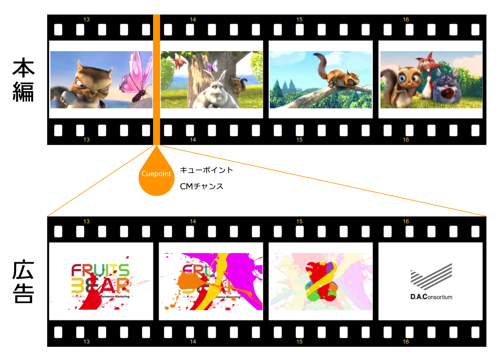

# DAC 新卒研修 VAST Server を作ろう
より実践的な最終課題となります。皆さんが作ったシステムで広告を配信してみましょう!!

## 準備されてるもの
このドキュメント以外に次のものが準備されています。最初は理解できなくても良いです。作っていく間に必要になると思います。その時下記を参照してください。

### 仕様書
`ユースケース図` `ER図` `ロバストネス図` `モックアップ`があります。それぞれの図の意味が分からない場合はトレナーやメンターに聞いてください。（もしくは検索してください。）

[仕様書](https://dac.box.com/s/1bsi3mk748b5vjdp7tog78q59plxxiya)

### サンプルキャンペーン用動画URL
* [http://img.ak.impact-ad.jp/pp/vfiles/dac_demo_eye.mp4]()
* [http://img.ak.impact-ad.jp/pp/vfiles/fruitsbear_15sec.mp4]()

### VAST用XMLのテンプレート
* [XML](https://github.com/kuro-daei/dac_vast/blob/master/app/views/campaigns/index.xml.erb)

VAST XMLをレスポンスで戻す場合は[CORS\(Cross-Origin Resource Sharin\)](https://developer.mozilla.org/ja/docs/Web/HTTP/HTTP_access_control)に対応させる必要があるため、下記のコードをControllerに追加する必要があります。(一旦呪文として覚えておいてください。)
```ruby
response.headers['Access-Control-Allow-Origin'] = request.headers['Origin'] || '*'
response.headers['Access-Control-Allow-Methods'] = 'GET'
headers['Access-Control-Request-Method'] = '*'
headers['Access-Control-Allow-Credentials'] = 'true'
headers['Access-Control-Allow-Headers'] = 'Origin, Content-Type'
```

また、トラッキングリクエストした際に期待されるレスポンスはtypeを`image/gif`にする必要があります。
トラッキング時の処理では以下の1x1データをレスポンスするコードを追加する必要があります。（こちらも呪文として覚えておいてください。）
```ruby
send_data(Base64.decode64('R0lGODlhAQABAPAAAAAAAAAAACH5BAEAAAAALAAAAAABAAEAAAICRAEAOw=='),
type: 'image/gif', disposition: 'inline')
```

### 確認用Webページ
システムが完成したら下記の確認ページをダウンロードしてVAST URLを入力してください。

[dac\_video\_player.zip](doc/images/dac_video_player.zip)


## VAST Server とは
`VAST Server` とは `Ad Server` の一種で、主に動画広告を配信するためのシステムです。まずは`Ad Server`の役割を見ていきましょう。

## AD Serverとは
広告の配信と制御を行うためのシステムです。例えば「日経新聞の右上の広告枠に来週一杯、IBMの画像を配信したい。」というような時に利用します。例えば下記のような制御が出来ます。

* 特定場所に広告を配信する。
* 期間を指定する。
* 表示回数の上限を指定して、その上限に達すると配信を止める。
* 配信結果をレポートする。

## VASTとは
Video Ad Serving Templateの略で、動画の広告を配信するときに用いる **フォーマットの規格** です。詳しい内容はこの講習では理解する必要ありません。開発時に必要が出てきたら[このテンプレート](https://github.com/kuro-daei/dac_vast/blob/master/app/views/campaigns/index.xml.erb)を利用してください。*TODOの箇所は自分でコーディングしてください。*

## 普通の動画広告
Youtubeの動画広告などが一般的に目にする動画広告です。主となる動画(本編)があって、その冒頭や途中などに出る広告を **インストリーム広告 - Instream** と言います。この広告が差し込まれる場所を **キューポイント - Cuepoint** と呼びます。*ちなみに日本ではCMチャンスと呼んだりします。*



## 今回の目指すもの
課題のため幾つか簡単な設定にしています。まずは広告ですが本編動画の途中に表示されるのではなく、Webサイトに直接表示されるようにします。このように本編動画が無い場所に表示される動画広告を **アウトストリーム - Outstream** と呼びます。

Webページに`VAST URL`を入力したら動画広告が流れるようにします。Webページは[準備されているもの](doc/images/dac_video_player.zip)を使ったください。下記のように動画が再生されるはずです。


## 用語と概要
* `Cuepoint` 広告を差し込む場所を意味します。名前(name)のみ保持します。各Cuepoint毎にURL(VAST URL)が一意に決まります。そのURLにアクセスするとXMLが返されます。
* `Campaign` 広告の案件を意味します。名前(name)と期間(start\_at〜end\_at)・上限の再生回数(limit\_start)・動画のURL(movie_url)を保持します。現在が再生期間内であり、再生回数が上限の再生回数未満であれば配信可能な`Campaign`です。
* `Result` 結果を保持します。動画が再生されると再生回数(count\_start) が加算されます動画が最後(15秒)まで行くと完了回数(count\_end)が加算されます。
* `Cuepoint`と`Campaign`は多対多の関係です。つまり、一つの`Campaign`が複数`Cuepoint`で配信される可能性があり、一つの`Cuepoint`に複数の`Campaign`が配信される事もあります。
 
